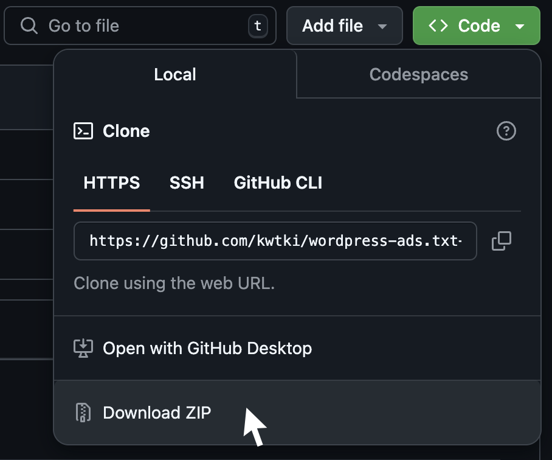
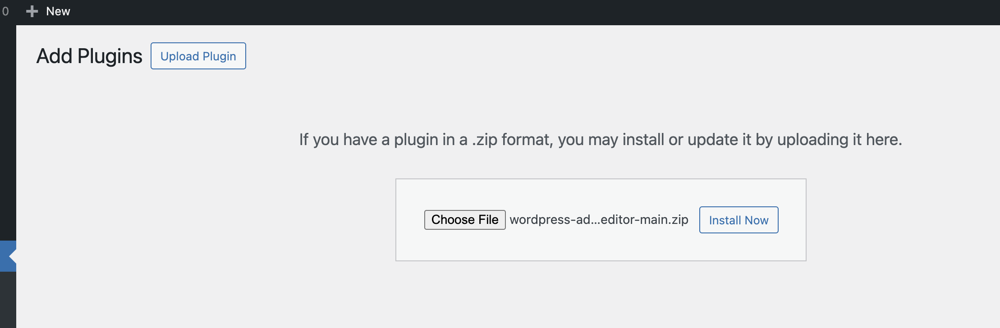
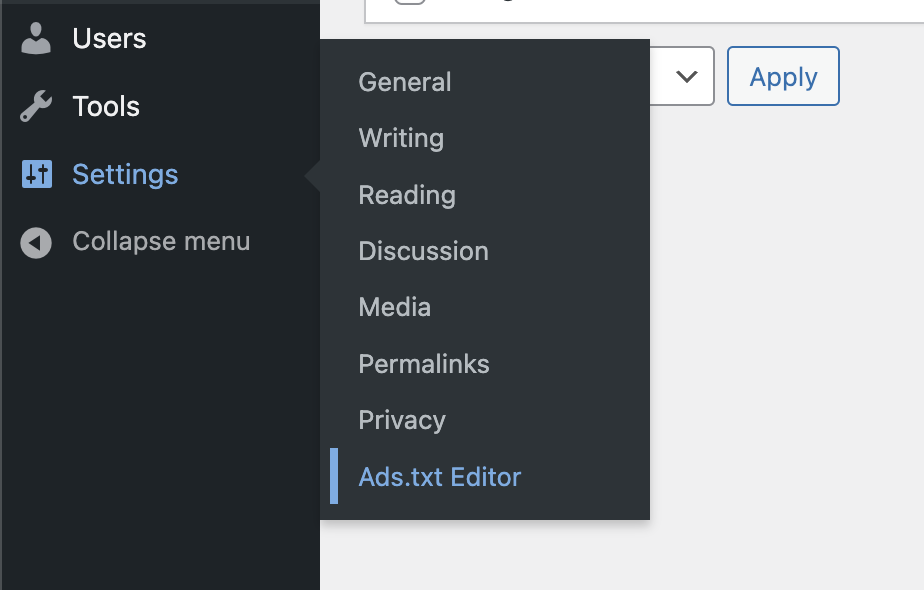
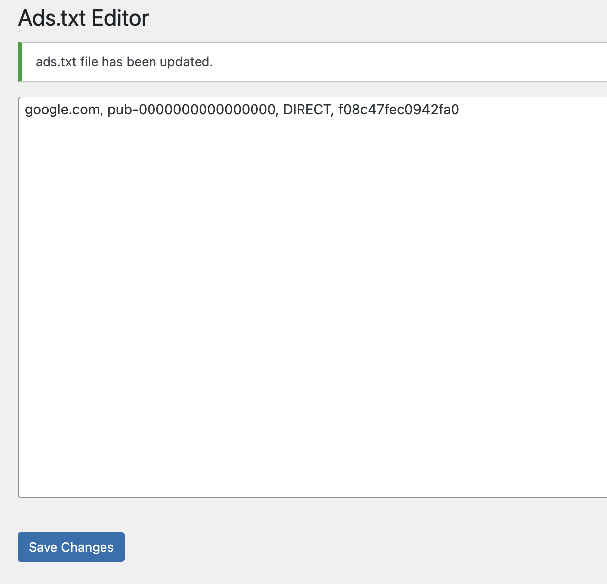
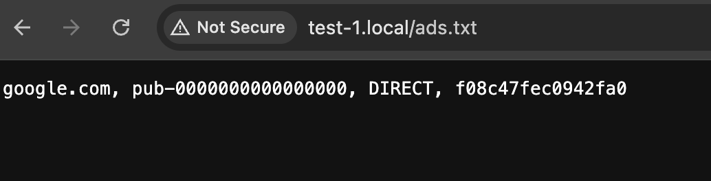

# Ads.txt Editor

For ad services like Google AdSense, it’s essential to have an ads.txt file accessible on the internet.

This is a simple editor that allows you to manage your ads.txt file without any hassle. This plugin is lightweight and should have minimal impact on your WordPress site’s performance.

Simply download this as a .zip file and upload it to your WordPress plugin management console.

# Ads.txt エディター

Google AdSenseなどの広告サービスを利用するためには、インターネット上でアクセス可能なads.txtファイルが必要です。

このエディターは、手間をかけずにads.txtファイルを管理できるシンプルなツールです。このプラグインはもともとコードが少なく、WordPressサイトのパフォーマンスにはほとんど影響を与えません。

.zipファイルとしてダウンロードし、WordPressのプラグイン管理コンソールにアップロードしてください。

# How to Use This Repository as Plugin

## Upload the .zip file on Plug-in console

After installation, activate the plugin.

## Go to Ads.txt editor

Go to Settings > Ads.txt Editor

## Add your adsence text

Visit `your_domain.com/ads.txt` to verify that the ads.txt file is accessible for crawling.

